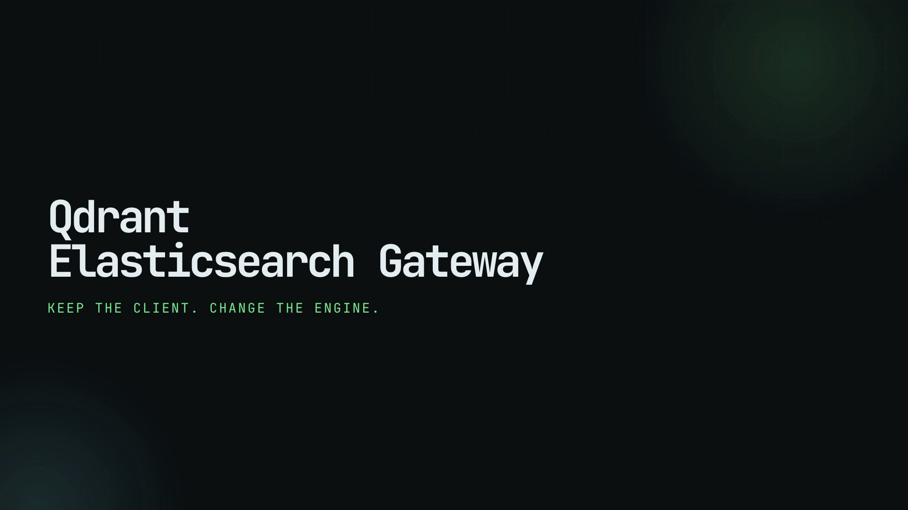

# qdrant-es-gateway

`qdrant-es-gateway` exposes a deliberately useful subset of the Elasticsearch REST API backed by Qdrant. It targets ordinary application search—catalogues, documentation, jobs, tickets, and content—not Kibana, logging, or complete Elasticsearch replacement.

[](docs/assets/qdrant-es-gateway-launch.mp4)

See the [launch video](docs/assets/qdrant-es-gateway-launch.mp4) for the endpoint-only migration story and measured 500,000-product comparison.

## Five-minute quickstart

```bash
docker compose up --build
curl -X PUT localhost:9200/products -H content-type:application/json -d '{"mappings":{"properties":{"title":{"type":"text"},"description":{"type":"text"},"brand":{"type":"keyword"},"price":{"type":"float"}}}}'
curl -X POST localhost:9200/products/_bulk -H content-type:application/x-ndjson --data-binary $'{"index":{"_id":"a1"}}\n{"title":"Wireless headphones","description":"Noise cancelling over-ear headset","brand":"Acme","price":99}\n'
curl -s localhost:9200/products/_search -H content-type:application/json -d '{"query":{"match":{"title":"wireless headphones"}},"size":10}'
```

The root endpoint includes `X-Elastic-Product: Elasticsearch` and an 8.x-compatible version shape so ordinary official clients can connect. The product name and supported surface remain intentionally explicit.

## Compatibility snapshot

| Capability | Status | Notes |
|---|---:|---|
| Root, cluster health, healthz/readyz | ✅ | Health reflects Qdrant connectivity |
| Index lifecycle and mappings | ✅ | Mapping metadata is durable in SQLite |
| CRUD and `_update` doc subset | ✅ | Script updates rejected |
| `_bulk` index/create/update/delete | ✅ | NDJSON, batched at the API boundary |
| `match`, `match_phrase` | ⚠️ | Native Qdrant BM25; phrase is lexical, not Lucene-identical |
| `multi_match` with boosts | ⚠️ | One named sparse representation per text field, merged in gateway |
| `term`, `terms`, `range`, `exists`, `ids` | ✅ | Qdrant payload filters |
| bool must/filter/must_not/should | ✅ | Filter-only `should` with `minimum_should_match` is supported |
| from/size, source filtering | ✅ | Supports `_source:false`, includes, and excludes; deep pagination is capped |
| search_after | ❌ | Explicit structured 400; use bounded `from`/`size` |
| field sorting | ⚠️ | Safe basic response sorting; Qdrant-native ordering is preferred for large data |
| terms aggregations | ⚠️ | Native Qdrant facet over indexed keyword fields only |
| aliases | ⚠️ | Durable gateway aliases; native atomic switching is future work |
| regexp, wildcard, prefix | ⚠️ | Gateway-side Rust matching in positive must/filter clauses; scans candidate documents and is not suitable for unbounded high-cardinality pattern queries |
| `dis_max`, `match_bool_prefix`, fuzzy-shaped queries | ⚠️ | Accepted through the lexical path; ranking and typo/prefix behavior are approximate |
| `post_filter`, min/max/filter aggregations | ⚠️ | Supported for simple clauses over bounded retrieved candidates |
| scripts, scroll, arbitrary aggs | ❌ | Clear structured 400 errors |

See [docs/compatibility.md](docs/compatibility.md) for semantic differences and [docs/architecture.md](docs/architecture.md) for the design.

Measured storage trade-offs for the two-collection projection are documented in [docs/storage-findings.md](docs/storage-findings.md).

For a deterministic, endpoint-only application workflow covering catalogue search, facets, source responses, updates, deletes, and pattern queries, see [validation/README.md](validation/README.md). The published application-target research and staged Spinscale/AWS Retail validation plan are in [docs/application-validation.md](docs/application-validation.md).

## Configuration

Copy `.env.example` to `.env`. `QDRANT_URL`, `QDRANT_API_KEY`, `LISTEN_ADDR`, `LOG_LEVEL`, `ES_COMPAT_VERSION`, and `COMPATIBILITY_ANALYTICS` are the important settings. Secrets are only sent as the Qdrant `api-key` header and are never logged.

For write-heavy catalogues, set `DOCUMENT_PROJECTION=true`. Each ES index then gets a second Qdrant collection named `es_<index>_documents`. It has no payload indexes and is the durable source for GETs and full `_source` responses; the normal collection remains the searchable projection. Set `ASYNC_SEARCH_PROJECTION=true` to wait for the source write but let the search projection converge with Qdrant's asynchronous operation acknowledgement. This preserves a stateless gateway tier, but production deployments should pair it with a durable projection worker/reconciliation process rather than relying on an in-process queue. Fields used for filters or sorts remain mirrored in the search projection; unmapped metadata-only updates avoid sparse-index work.

## Official client example

```python
from elasticsearch import Elasticsearch

client = Elasticsearch("http://localhost:9200")
client.index(index="products", id="a2", document={"title": "USB-C charger"})
print(client.search(index="products", query={"match": {"title": "charger"}}))
```

The SDK is not required by the gateway. It is a compatibility target; mappings and unsupported features should be checked against the matrix before migration.

## Development

```bash
make test
make lint
docker compose up --build
make integration-test
```

The metadata database is gateway-owned and should be persisted alongside the deployment. Qdrant remains the source of document and search state. The gateway deterministically maps each `(index, Elasticsearch _id)` to a UUID-shaped Qdrant point ID and stores the original `_id` in payload, so arbitrary Unicode and long IDs survive restarts without an in-memory lookup. With `DOCUMENT_PROJECTION=true`, the gateway retrieves search hits' sources in one batch from the document collection, avoiding an N+1 fetch pattern.

## Honest limitations

Scores are Qdrant BM25 scores, not Lucene scores. Refresh/version/sequence semantics are approximations. Analyzer configuration, arbitrary aggregations, deep scored pagination, nested/parent-child documents, scripts, and Elasticsearch security APIs are intentionally outside the MVP. Unsupported requests fail loudly rather than silently dropping clauses.

License: Apache-2.0.
