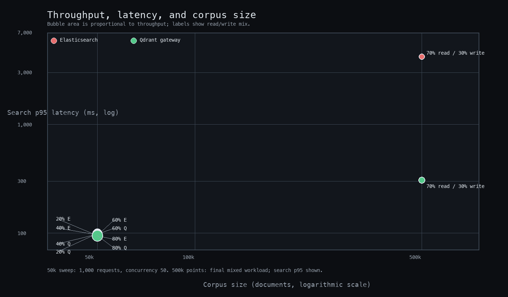

# Read/write crossover

For product search, updates do not all need to block the user-facing request. A price or stock update can be accepted, applied asynchronously, and become searchable shortly afterwards. That makes the useful question less binary than “can the gateway beat a native write?”: how much of the workload is customer-facing retrieval, and how much is synchronous mutation?

## Focused mix sweep

The sweep used the same Elasticsearch-shaped client calls against both services:

- 50,000 product documents
- 1,000 requests per point
- 50 concurrent clients
- read/search traffic split evenly between `_search` and `GET _doc`
- write traffic made up of single-document `_update` calls
- `ASYNC_PAYLOAD_WRITES=true` for the gateway

| Read/search share | Write/update share | Elasticsearch throughput | Qdrant gateway throughput | Approximate winner |
|---:|---:|---:|---:|---|
| 20% | 80% | 1,166.90 req/s | 962.31 req/s | Elasticsearch |
| 40% | 60% | 1,080.77 req/s | 1,177.88 req/s | Qdrant gateway |
| 60% | 40% | 1,071.20 req/s | 1,059.19 req/s | Near tie |
| 80% | 20% | 1,091.95 req/s | 1,308.47 req/s | Qdrant gateway |

The practical crossover is therefore around 40–60% read/search traffic for this profile. At roughly 40% reads, the gateway begins to lead on throughput; at 60%, the two paths are effectively tied; and at 80%, the gateway has a clear throughput advantage. This is a workload boundary, not a universal constant: corpus size, query shape, update fields, concurrency, and the freshness window all move it.

The 500,000-document mixed run reinforces the shape of the result. With 70% search/read and 30% update/delete traffic, throughput was 77.42 req/s for Elasticsearch and 263.32 req/s for the gateway. Search p95 was 4,213.6 ms versus 305.82 ms. The gateway’s asynchronous update mode is a good fit when the product can tolerate eventual search visibility for ordinary catalog changes.

## How to use the crossover

For a catalog workload dominated by imports, synchronous writes, or strict read-after-write requirements, native Elasticsearch remains the safer baseline. For a product experience dominated by retrieval—especially when updates can flow through an event queue or tolerate a short freshness delay—the gateway becomes increasingly attractive.

The next production decision should be based on the application’s freshness contract: measure the acceptable update-to-search delay, then place the workload on this curve using the same query mix and concurrency as the real service.
